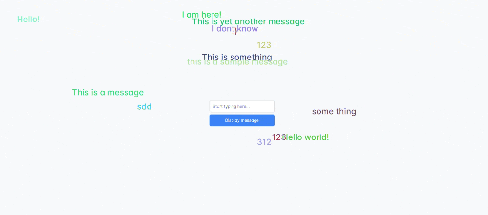

# NxChat

## Description

This repository contains all files to run a simple network chat application. The repository uses NX-Monorepo (https://nx.dev/) to manage all application/libraries easily. The application is divided into

- **chat-api** - A simple backend application running on Node.js and written with TypeScript. In order for the app to successfully connect to the database it needs .env file that exposes information for the database connection (`HOST`, `USER`, `PASSWORD`, `PORT`, `DBNAME`). The .env file should be located in `<projectRoot>/apps/chat-api`. The database, that the project requires is PostgreSQL.

- **nx-chat** - Simple Angular application that runs the front-end for the application.

## Database seeding

In order to successfully run the application you need to configure a PostreSQL database with correct tables. When running the backend service, the script will connect to the database specified in the `.env` file and create all neccessary tables automatically.

## WebSockets

The application acts as a client and uses websocket protocol (RFC - https://datatracker.ietf.org/doc/html/rfc6455) to connect to the server. This allows for two-way communication between the client and the server and allows to retrieve/send messages from/to the database. 

## How chat works

When application is successfully configured and running, the user can type into the field any message. When the user presses the `Display message` button, the message gets displayed on screen and gets sent to the backend service. All the users that are also connected should automatically retrieve the same message. All the previously added messages by all users should persist on the database, so that when any user refreshes the website, the messages that were previously added should be displayed on screen again. 

## Running locally

In order to run the application locally follow these steps

1) Make sure you have PostgreSQL installed
2) Make sure your PostgreSQL is configured (you have created a database and a root user with password)
3) Run `npm install` while being in the `<projectRoot>`
4) Create before mentioned `.env` file in the `<projectRoot>/apps/chat-api`
5) Run `nx serve chat-api` - this will run the backend serivce locally on port 3000
6) Run `nx serve nx-chat` - this will run the frontend application locally on port 4200

When all steps have been done correctly, when you go to `http://localhost:4200` you should see the application running.

Good luck!